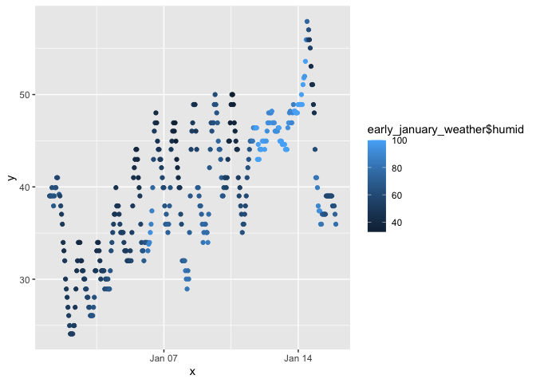

p8105_hw1_crd2162
================
2023-09-18

## Problem 1

``` r
library (moderndive)
library (tidyverse)
```

    ## ── Attaching core tidyverse packages ──────────────────────── tidyverse 2.0.0 ──
    ## ✔ dplyr     1.1.3     ✔ readr     2.1.4
    ## ✔ forcats   1.0.0     ✔ stringr   1.5.0
    ## ✔ ggplot2   3.4.3     ✔ tibble    3.2.1
    ## ✔ lubridate 1.9.2     ✔ tidyr     1.3.0
    ## ✔ purrr     1.0.2     
    ## ── Conflicts ────────────────────────────────────────── tidyverse_conflicts() ──
    ## ✖ dplyr::filter() masks stats::filter()
    ## ✖ dplyr::lag()    masks stats::lag()
    ## ℹ Use the conflicted package (<http://conflicted.r-lib.org/>) to force all conflicts to become errors

``` r
data ("early_january_weather")
```

The dataset early_january_weather contains early January hourly weather
data for LGA, JFK, and EWR for the month of January 2013. The dataset
contains 15 variables and 358 rows of observations. The variables
included in the dataset are origin, year, month, day, hour, temp, dewp,
humid, wind_dir, wind_speed, wind_gust, precip, pressure, visib,
time_hour.

We will be analyzing the variables of temp, time_hour, and humid. Their
values are as follows:

``` r
early_january_weather$temp
```

    ##   [1] 39.02 39.02 39.02 39.92 39.02 37.94 39.02 39.92 39.92 41.00 41.00 39.20
    ##  [13] 39.02 37.94 37.04 35.96 33.98 33.08 32.00 30.02 28.94 28.04 26.96 26.06
    ##  [25] 24.98 24.08 24.08 24.08 24.08 24.98 24.98 26.96 28.94 30.92 32.00 33.98
    ##  [37] 33.98 33.98 32.00 32.00 30.92 30.92 30.02 30.02 28.94 28.94 28.04 28.04
    ##  [49] 26.96 26.96 26.06 26.06 26.06 26.06 26.96 28.04 30.92 30.92 33.08 33.98
    ##  [61] 33.98 33.08 32.00 30.02 30.92 30.92 30.92 30.92 28.94 30.02 30.02 28.94
    ##  [73] 30.02 28.94 28.94 30.92 33.08 33.98 35.06 35.96 37.04 37.04 39.92 37.94
    ##  [85] 37.94 37.94 37.04 35.96 35.06 35.06 35.06 35.06 33.98 33.08 33.08 33.08
    ##  [97] 32.00 32.00 32.00 32.00 33.08 32.00 35.06 37.94 41.00 42.08 42.98 44.06
    ## [109] 44.06 42.98 41.00 39.92 39.02 35.96 33.98 33.08 33.08 32.00 33.98 33.98
    ## [121] 33.98 33.98 33.08 33.80 33.98 35.06 35.96 37.40 39.92 42.98 46.04 46.94
    ## [133] 48.02 46.94 44.96 44.06 44.06 42.98 42.98 42.08 41.00 39.92 39.92 37.94
    ## [145] 35.96 37.04 35.96 35.06 35.96 37.94 39.92 44.06 44.96 46.04 46.94 46.04
    ## [157] 46.94 44.96 42.98 42.08 41.00 39.92 39.92 37.04 35.96 32.00 32.00 32.00
    ## [169] 32.00 30.92 30.02 28.94 30.92 30.02 35.06 39.02 44.06 46.04 46.94 48.92
    ## [181] 48.92 48.92 46.04 44.06 39.92 39.92 39.02 37.94 37.94 37.04 35.96 33.98
    ## [193] 35.06 35.96 35.96 35.06 35.06 33.98 37.04 42.08 44.06 46.94 46.04 46.94
    ## [205] 46.94 48.92 50.00 48.92 48.02 46.94 44.96 44.06 44.06 42.98 41.00 39.02
    ## [217] 39.02 39.92 41.00 41.00 39.92 41.00 42.98 44.96 44.96 46.94 48.92 50.00
    ## [229] 50.00 48.92 46.94 46.04 44.96 44.06 44.06 41.00 39.02 39.92 37.94 37.04
    ## [241] 35.06 35.96 35.96 37.04 37.94 39.02 41.00 42.08 42.98 44.06 44.96 44.96
    ## [253] 44.96 44.96 46.40 46.40 46.40 46.40 46.40 42.98 44.60 42.98 44.06 44.06
    ## [265] 44.06 44.96 44.96 44.96 44.06 44.96 44.96 46.04 46.94 48.02 46.94 48.02
    ## [277] 48.02 48.20 46.94 46.94 46.94 46.04 46.04 46.04 46.04 46.40 46.40 44.96
    ## [289] 44.96 44.96 44.60 44.60 44.60 44.60 44.06 44.06 44.06 46.40 46.94 48.02
    ## [301] 48.20 46.94 46.94 48.02 48.92 48.20 48.20 48.02 48.02 48.02 48.92 48.92
    ## [313] 48.92 48.92 50.00 48.92 51.08 51.80 51.98 53.60 55.94 57.92 55.94 57.02
    ## [325] 55.94 55.04 53.06 51.08 51.08 48.92 48.02 44.06 41.00 41.00 39.92 37.94
    ## [337] 37.40 37.40 35.96 35.96 37.04 37.04 37.04 37.04 37.04 39.02 39.02 39.02
    ## [349] 39.02 39.02 39.02 39.02 39.02 37.94 37.94 37.94 37.04 35.96

``` r
early_january_weather$time_hour
```

    ##   [1] "2013-01-01 01:00:00 EST" "2013-01-01 02:00:00 EST"
    ##   [3] "2013-01-01 03:00:00 EST" "2013-01-01 04:00:00 EST"
    ##   [5] "2013-01-01 05:00:00 EST" "2013-01-01 06:00:00 EST"
    ##   [7] "2013-01-01 07:00:00 EST" "2013-01-01 08:00:00 EST"
    ##   [9] "2013-01-01 09:00:00 EST" "2013-01-01 10:00:00 EST"
    ##  [11] "2013-01-01 11:00:00 EST" "2013-01-01 13:00:00 EST"
    ##  [13] "2013-01-01 14:00:00 EST" "2013-01-01 15:00:00 EST"
    ##  [15] "2013-01-01 16:00:00 EST" "2013-01-01 17:00:00 EST"
    ##  [17] "2013-01-01 18:00:00 EST" "2013-01-01 19:00:00 EST"
    ##  [19] "2013-01-01 20:00:00 EST" "2013-01-01 21:00:00 EST"
    ##  [21] "2013-01-01 22:00:00 EST" "2013-01-01 23:00:00 EST"
    ##  [23] "2013-01-02 00:00:00 EST" "2013-01-02 01:00:00 EST"
    ##  [25] "2013-01-02 02:00:00 EST" "2013-01-02 03:00:00 EST"
    ##  [27] "2013-01-02 04:00:00 EST" "2013-01-02 05:00:00 EST"
    ##  [29] "2013-01-02 06:00:00 EST" "2013-01-02 07:00:00 EST"
    ##  [31] "2013-01-02 08:00:00 EST" "2013-01-02 09:00:00 EST"
    ##  [33] "2013-01-02 10:00:00 EST" "2013-01-02 11:00:00 EST"
    ##  [35] "2013-01-02 12:00:00 EST" "2013-01-02 13:00:00 EST"
    ##  [37] "2013-01-02 14:00:00 EST" "2013-01-02 15:00:00 EST"
    ##  [39] "2013-01-02 16:00:00 EST" "2013-01-02 17:00:00 EST"
    ##  [41] "2013-01-02 18:00:00 EST" "2013-01-02 19:00:00 EST"
    ##  [43] "2013-01-02 20:00:00 EST" "2013-01-02 21:00:00 EST"
    ##  [45] "2013-01-02 22:00:00 EST" "2013-01-02 23:00:00 EST"
    ##  [47] "2013-01-03 00:00:00 EST" "2013-01-03 01:00:00 EST"
    ##  [49] "2013-01-03 02:00:00 EST" "2013-01-03 03:00:00 EST"
    ##  [51] "2013-01-03 04:00:00 EST" "2013-01-03 05:00:00 EST"
    ##  [53] "2013-01-03 06:00:00 EST" "2013-01-03 07:00:00 EST"
    ##  [55] "2013-01-03 08:00:00 EST" "2013-01-03 09:00:00 EST"
    ##  [57] "2013-01-03 10:00:00 EST" "2013-01-03 11:00:00 EST"
    ##  [59] "2013-01-03 12:00:00 EST" "2013-01-03 13:00:00 EST"
    ##  [61] "2013-01-03 14:00:00 EST" "2013-01-03 15:00:00 EST"
    ##  [63] "2013-01-03 16:00:00 EST" "2013-01-03 17:00:00 EST"
    ##  [65] "2013-01-03 18:00:00 EST" "2013-01-03 19:00:00 EST"
    ##  [67] "2013-01-03 20:00:00 EST" "2013-01-03 21:00:00 EST"
    ##  [69] "2013-01-03 22:00:00 EST" "2013-01-03 23:00:00 EST"
    ##  [71] "2013-01-04 00:00:00 EST" "2013-01-04 01:00:00 EST"
    ##  [73] "2013-01-04 02:00:00 EST" "2013-01-04 03:00:00 EST"
    ##  [75] "2013-01-04 04:00:00 EST" "2013-01-04 05:00:00 EST"
    ##  [77] "2013-01-04 06:00:00 EST" "2013-01-04 07:00:00 EST"
    ##  [79] "2013-01-04 08:00:00 EST" "2013-01-04 09:00:00 EST"
    ##  [81] "2013-01-04 10:00:00 EST" "2013-01-04 11:00:00 EST"
    ##  [83] "2013-01-04 12:00:00 EST" "2013-01-04 13:00:00 EST"
    ##  [85] "2013-01-04 14:00:00 EST" "2013-01-04 15:00:00 EST"
    ##  [87] "2013-01-04 16:00:00 EST" "2013-01-04 17:00:00 EST"
    ##  [89] "2013-01-04 18:00:00 EST" "2013-01-04 19:00:00 EST"
    ##  [91] "2013-01-04 20:00:00 EST" "2013-01-04 21:00:00 EST"
    ##  [93] "2013-01-04 22:00:00 EST" "2013-01-04 23:00:00 EST"
    ##  [95] "2013-01-05 00:00:00 EST" "2013-01-05 01:00:00 EST"
    ##  [97] "2013-01-05 02:00:00 EST" "2013-01-05 03:00:00 EST"
    ##  [99] "2013-01-05 04:00:00 EST" "2013-01-05 05:00:00 EST"
    ## [101] "2013-01-05 06:00:00 EST" "2013-01-05 07:00:00 EST"
    ## [103] "2013-01-05 08:00:00 EST" "2013-01-05 09:00:00 EST"
    ## [105] "2013-01-05 10:00:00 EST" "2013-01-05 11:00:00 EST"
    ## [107] "2013-01-05 12:00:00 EST" "2013-01-05 13:00:00 EST"
    ## [109] "2013-01-05 14:00:00 EST" "2013-01-05 15:00:00 EST"
    ## [111] "2013-01-05 16:00:00 EST" "2013-01-05 17:00:00 EST"
    ## [113] "2013-01-05 18:00:00 EST" "2013-01-05 19:00:00 EST"
    ## [115] "2013-01-05 20:00:00 EST" "2013-01-05 21:00:00 EST"
    ## [117] "2013-01-05 22:00:00 EST" "2013-01-05 23:00:00 EST"
    ## [119] "2013-01-06 00:00:00 EST" "2013-01-06 01:00:00 EST"
    ## [121] "2013-01-06 02:00:00 EST" "2013-01-06 03:00:00 EST"
    ## [123] "2013-01-06 04:00:00 EST" "2013-01-06 05:00:00 EST"
    ## [125] "2013-01-06 06:00:00 EST" "2013-01-06 07:00:00 EST"
    ## [127] "2013-01-06 08:00:00 EST" "2013-01-06 09:00:00 EST"
    ## [129] "2013-01-06 10:00:00 EST" "2013-01-06 11:00:00 EST"
    ## [131] "2013-01-06 12:00:00 EST" "2013-01-06 13:00:00 EST"
    ## [133] "2013-01-06 14:00:00 EST" "2013-01-06 15:00:00 EST"
    ## [135] "2013-01-06 16:00:00 EST" "2013-01-06 17:00:00 EST"
    ## [137] "2013-01-06 18:00:00 EST" "2013-01-06 19:00:00 EST"
    ## [139] "2013-01-06 20:00:00 EST" "2013-01-06 21:00:00 EST"
    ## [141] "2013-01-06 22:00:00 EST" "2013-01-06 23:00:00 EST"
    ## [143] "2013-01-07 00:00:00 EST" "2013-01-07 01:00:00 EST"
    ## [145] "2013-01-07 02:00:00 EST" "2013-01-07 03:00:00 EST"
    ## [147] "2013-01-07 04:00:00 EST" "2013-01-07 05:00:00 EST"
    ## [149] "2013-01-07 06:00:00 EST" "2013-01-07 07:00:00 EST"
    ## [151] "2013-01-07 08:00:00 EST" "2013-01-07 09:00:00 EST"
    ## [153] "2013-01-07 10:00:00 EST" "2013-01-07 11:00:00 EST"
    ## [155] "2013-01-07 12:00:00 EST" "2013-01-07 13:00:00 EST"
    ## [157] "2013-01-07 14:00:00 EST" "2013-01-07 15:00:00 EST"
    ## [159] "2013-01-07 16:00:00 EST" "2013-01-07 17:00:00 EST"
    ## [161] "2013-01-07 18:00:00 EST" "2013-01-07 19:00:00 EST"
    ## [163] "2013-01-07 20:00:00 EST" "2013-01-07 21:00:00 EST"
    ## [165] "2013-01-07 22:00:00 EST" "2013-01-07 23:00:00 EST"
    ## [167] "2013-01-08 00:00:00 EST" "2013-01-08 01:00:00 EST"
    ## [169] "2013-01-08 02:00:00 EST" "2013-01-08 03:00:00 EST"
    ## [171] "2013-01-08 04:00:00 EST" "2013-01-08 05:00:00 EST"
    ## [173] "2013-01-08 06:00:00 EST" "2013-01-08 07:00:00 EST"
    ## [175] "2013-01-08 08:00:00 EST" "2013-01-08 09:00:00 EST"
    ## [177] "2013-01-08 10:00:00 EST" "2013-01-08 11:00:00 EST"
    ## [179] "2013-01-08 12:00:00 EST" "2013-01-08 13:00:00 EST"
    ## [181] "2013-01-08 14:00:00 EST" "2013-01-08 15:00:00 EST"
    ## [183] "2013-01-08 16:00:00 EST" "2013-01-08 17:00:00 EST"
    ## [185] "2013-01-08 18:00:00 EST" "2013-01-08 19:00:00 EST"
    ## [187] "2013-01-08 20:00:00 EST" "2013-01-08 21:00:00 EST"
    ## [189] "2013-01-08 22:00:00 EST" "2013-01-08 23:00:00 EST"
    ## [191] "2013-01-09 00:00:00 EST" "2013-01-09 01:00:00 EST"
    ## [193] "2013-01-09 02:00:00 EST" "2013-01-09 03:00:00 EST"
    ## [195] "2013-01-09 04:00:00 EST" "2013-01-09 05:00:00 EST"
    ## [197] "2013-01-09 06:00:00 EST" "2013-01-09 07:00:00 EST"
    ## [199] "2013-01-09 08:00:00 EST" "2013-01-09 09:00:00 EST"
    ## [201] "2013-01-09 10:00:00 EST" "2013-01-09 11:00:00 EST"
    ## [203] "2013-01-09 12:00:00 EST" "2013-01-09 13:00:00 EST"
    ## [205] "2013-01-09 14:00:00 EST" "2013-01-09 15:00:00 EST"
    ## [207] "2013-01-09 16:00:00 EST" "2013-01-09 17:00:00 EST"
    ## [209] "2013-01-09 18:00:00 EST" "2013-01-09 19:00:00 EST"
    ## [211] "2013-01-09 20:00:00 EST" "2013-01-09 21:00:00 EST"
    ## [213] "2013-01-09 22:00:00 EST" "2013-01-09 23:00:00 EST"
    ## [215] "2013-01-10 00:00:00 EST" "2013-01-10 01:00:00 EST"
    ## [217] "2013-01-10 02:00:00 EST" "2013-01-10 03:00:00 EST"
    ## [219] "2013-01-10 04:00:00 EST" "2013-01-10 05:00:00 EST"
    ## [221] "2013-01-10 06:00:00 EST" "2013-01-10 07:00:00 EST"
    ## [223] "2013-01-10 08:00:00 EST" "2013-01-10 09:00:00 EST"
    ## [225] "2013-01-10 10:00:00 EST" "2013-01-10 11:00:00 EST"
    ## [227] "2013-01-10 12:00:00 EST" "2013-01-10 13:00:00 EST"
    ## [229] "2013-01-10 14:00:00 EST" "2013-01-10 15:00:00 EST"
    ## [231] "2013-01-10 16:00:00 EST" "2013-01-10 17:00:00 EST"
    ## [233] "2013-01-10 18:00:00 EST" "2013-01-10 19:00:00 EST"
    ## [235] "2013-01-10 20:00:00 EST" "2013-01-10 21:00:00 EST"
    ## [237] "2013-01-10 22:00:00 EST" "2013-01-10 23:00:00 EST"
    ## [239] "2013-01-11 00:00:00 EST" "2013-01-11 01:00:00 EST"
    ## [241] "2013-01-11 02:00:00 EST" "2013-01-11 03:00:00 EST"
    ## [243] "2013-01-11 04:00:00 EST" "2013-01-11 05:00:00 EST"
    ## [245] "2013-01-11 06:00:00 EST" "2013-01-11 07:00:00 EST"
    ## [247] "2013-01-11 08:00:00 EST" "2013-01-11 09:00:00 EST"
    ## [249] "2013-01-11 10:00:00 EST" "2013-01-11 11:00:00 EST"
    ## [251] "2013-01-11 12:00:00 EST" "2013-01-11 13:00:00 EST"
    ## [253] "2013-01-11 14:00:00 EST" "2013-01-11 15:00:00 EST"
    ## [255] "2013-01-11 16:00:00 EST" "2013-01-11 17:00:00 EST"
    ## [257] "2013-01-11 18:00:00 EST" "2013-01-11 19:00:00 EST"
    ## [259] "2013-01-11 20:00:00 EST" "2013-01-11 21:00:00 EST"
    ## [261] "2013-01-11 22:00:00 EST" "2013-01-11 23:00:00 EST"
    ## [263] "2013-01-12 00:00:00 EST" "2013-01-12 01:00:00 EST"
    ## [265] "2013-01-12 02:00:00 EST" "2013-01-12 03:00:00 EST"
    ## [267] "2013-01-12 04:00:00 EST" "2013-01-12 05:00:00 EST"
    ## [269] "2013-01-12 06:00:00 EST" "2013-01-12 07:00:00 EST"
    ## [271] "2013-01-12 08:00:00 EST" "2013-01-12 09:00:00 EST"
    ## [273] "2013-01-12 10:00:00 EST" "2013-01-12 11:00:00 EST"
    ## [275] "2013-01-12 12:00:00 EST" "2013-01-12 13:00:00 EST"
    ## [277] "2013-01-12 14:00:00 EST" "2013-01-12 15:00:00 EST"
    ## [279] "2013-01-12 16:00:00 EST" "2013-01-12 17:00:00 EST"
    ## [281] "2013-01-12 18:00:00 EST" "2013-01-12 19:00:00 EST"
    ## [283] "2013-01-12 20:00:00 EST" "2013-01-12 21:00:00 EST"
    ## [285] "2013-01-12 22:00:00 EST" "2013-01-12 23:00:00 EST"
    ## [287] "2013-01-13 00:00:00 EST" "2013-01-13 01:00:00 EST"
    ## [289] "2013-01-13 02:00:00 EST" "2013-01-13 03:00:00 EST"
    ## [291] "2013-01-13 04:00:00 EST" "2013-01-13 05:00:00 EST"
    ## [293] "2013-01-13 06:00:00 EST" "2013-01-13 07:00:00 EST"
    ## [295] "2013-01-13 08:00:00 EST" "2013-01-13 09:00:00 EST"
    ## [297] "2013-01-13 10:00:00 EST" "2013-01-13 11:00:00 EST"
    ## [299] "2013-01-13 12:00:00 EST" "2013-01-13 13:00:00 EST"
    ## [301] "2013-01-13 14:00:00 EST" "2013-01-13 15:00:00 EST"
    ## [303] "2013-01-13 16:00:00 EST" "2013-01-13 17:00:00 EST"
    ## [305] "2013-01-13 18:00:00 EST" "2013-01-13 19:00:00 EST"
    ## [307] "2013-01-13 20:00:00 EST" "2013-01-13 21:00:00 EST"
    ## [309] "2013-01-13 22:00:00 EST" "2013-01-13 23:00:00 EST"
    ## [311] "2013-01-14 00:00:00 EST" "2013-01-14 01:00:00 EST"
    ## [313] "2013-01-14 02:00:00 EST" "2013-01-14 03:00:00 EST"
    ## [315] "2013-01-14 04:00:00 EST" "2013-01-14 05:00:00 EST"
    ## [317] "2013-01-14 06:00:00 EST" "2013-01-14 07:00:00 EST"
    ## [319] "2013-01-14 08:00:00 EST" "2013-01-14 09:00:00 EST"
    ## [321] "2013-01-14 10:00:00 EST" "2013-01-14 11:00:00 EST"
    ## [323] "2013-01-14 12:00:00 EST" "2013-01-14 13:00:00 EST"
    ## [325] "2013-01-14 14:00:00 EST" "2013-01-14 15:00:00 EST"
    ## [327] "2013-01-14 16:00:00 EST" "2013-01-14 17:00:00 EST"
    ## [329] "2013-01-14 18:00:00 EST" "2013-01-14 19:00:00 EST"
    ## [331] "2013-01-14 20:00:00 EST" "2013-01-14 21:00:00 EST"
    ## [333] "2013-01-14 22:00:00 EST" "2013-01-14 23:00:00 EST"
    ## [335] "2013-01-15 00:00:00 EST" "2013-01-15 01:00:00 EST"
    ## [337] "2013-01-15 02:00:00 EST" "2013-01-15 03:00:00 EST"
    ## [339] "2013-01-15 04:00:00 EST" "2013-01-15 05:00:00 EST"
    ## [341] "2013-01-15 06:00:00 EST" "2013-01-15 07:00:00 EST"
    ## [343] "2013-01-15 08:00:00 EST" "2013-01-15 09:00:00 EST"
    ## [345] "2013-01-15 10:00:00 EST" "2013-01-15 11:00:00 EST"
    ## [347] "2013-01-15 12:00:00 EST" "2013-01-15 13:00:00 EST"
    ## [349] "2013-01-15 14:00:00 EST" "2013-01-15 15:00:00 EST"
    ## [351] "2013-01-15 16:00:00 EST" "2013-01-15 17:00:00 EST"
    ## [353] "2013-01-15 18:00:00 EST" "2013-01-15 19:00:00 EST"
    ## [355] "2013-01-15 20:00:00 EST" "2013-01-15 21:00:00 EST"
    ## [357] "2013-01-15 22:00:00 EST" "2013-01-15 23:00:00 EST"

``` r
early_january_weather$humid
```

    ##   [1]  59.37  61.63  64.43  62.21  64.43  67.21  64.43  62.21  62.21  59.65
    ##  [11]  57.06  69.67  54.68  57.04  49.62  49.83  45.43  42.84  49.19  48.48
    ##  [21]  48.69  48.15  50.34  52.25  54.65  51.93  51.93  51.93  51.93  52.50
    ##  [31]  52.50  48.36  46.41  44.92  44.74  41.33  37.86  39.72  44.74  44.74
    ##  [41]  46.74  49.01  50.84  50.84  55.69  55.69  57.79  57.79  60.41  60.41
    ##  [51]  62.70  62.70  65.21  65.21  65.84  62.97  51.38  49.01  42.84  41.33
    ##  [61]  41.33  44.92  46.92  53.29  51.38  51.38  51.38  53.44  60.69  60.38
    ##  [71]  60.38  63.10  63.24  66.09  68.68  66.34  60.81  60.93  58.37  54.21
    ##  [81]  47.75  47.75  44.33  46.09  47.89  47.89  49.62  54.21  56.18  56.18
    ##  [91]  53.66  53.66  53.91  55.89  53.36  51.33  53.60  53.60  53.60  53.60
    ## [101]  53.36  58.37  53.66  50.14  44.51  40.77  39.38  37.79  37.79  37.90
    ## [111]  42.51  44.33  49.93  56.32  60.93  66.11  66.11  69.04  63.77  63.77
    ## [121]  63.77  66.72  81.50  88.37  88.42  93.03  86.59  86.59  74.98  59.93
    ## [131]  51.03  45.48  40.22  40.35  47.23  48.87  46.73  48.70  50.94  52.73
    ## [141]  57.06  59.50  59.50  64.29  69.51  69.63  72.66  72.03  72.66  69.73
    ## [151]  64.54  50.73  43.49  39.90  36.85  35.05  33.88  33.55  36.18  37.46
    ## [161]  40.90  46.41  46.41  59.09  58.94  69.04  69.04  72.24  75.00  81.95
    ## [171]  81.27  81.80  78.35  81.27  72.03  66.85  55.02  53.33  51.55  47.86
    ## [181]  47.86  44.14  49.19  55.02  69.96  69.96  69.86  69.73  69.73  72.24
    ## [191]  75.39  81.57  78.13  78.79  75.39  78.13  78.13  85.24  78.31  67.22
    ## [201]  65.07  60.47  62.56  60.47  63.13  63.39  60.89  63.39  65.56  68.28
    ## [211]  73.59  72.98  70.42  67.81  70.08  69.86  66.85  59.50  54.97  54.97
    ## [221]  54.81  52.56  48.70  41.56  39.72  36.85  34.21  32.86  32.86  32.93
    ## [231]  36.85  38.12  41.56  43.02  43.02  52.56  56.77  52.79  59.22  59.09
    ## [241]  63.91  61.67  61.67  61.35  59.22  59.37  61.89  64.35  64.93  65.07
    ## [251]  70.52  73.59  76.25  82.38  82.45  93.40  95.99  95.99 100.00 100.00
    ## [261] 100.00 100.00 100.00  95.95 100.00 100.00 100.00 100.00 100.00  96.63
    ## [271]  96.63  92.75  92.78  89.08  92.78  89.08  89.08  92.78  92.78  92.78
    ## [281]  92.78  92.75  92.75  92.75  92.75  95.99 100.00 100.00 100.00 100.00
    ## [291] 100.00 100.00 100.00 100.00 100.00 100.00 100.00  93.40  93.40  89.08
    ## [301]  89.08  93.40  89.65  89.08  86.13  96.02 100.00 100.00 100.00 100.00
    ## [311] 100.00 100.00 100.00 100.00 100.00 100.00 100.00 100.00  96.73 100.00
    ## [321]  90.03  74.86  66.52  61.81  50.72  54.67  42.58  45.81  44.16  44.14
    ## [331]  43.67  59.64  79.21  82.09  85.61  89.25  93.14  93.14  85.37  81.72
    ## [341]  75.50  69.63  69.63  66.60  64.17  56.77  59.37  56.77  59.37  59.37
    ## [351]  56.77  59.37  59.37  61.94  59.22  64.29  72.24  78.79

The mean temperature in our dataset is 39.5821229

Now we will make a scatterplot comparing temp and time_hour with color
points indicating humidity:

``` r
plot_weather = tibble(
  x = early_january_weather$time_hour,
  y = early_january_weather$temp
  )

ggplot(plot_weather, aes(x = x, y = y, color = early_january_weather$humid)) + geom_point()
```

<!-- -->

## Problem 2

<!-- -->
