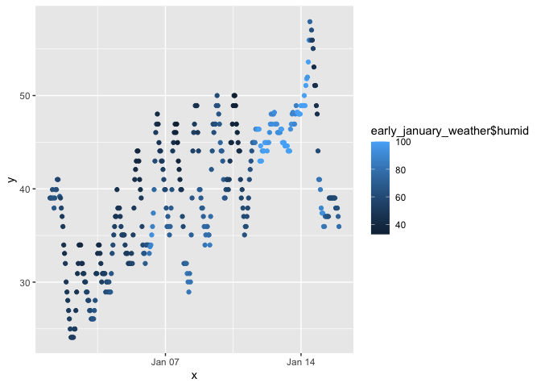

p8105_hw1_crd2162
================
Caleigh Dwyer
2023-09-18

## Problem 1

``` r
library (moderndive)
library (tidyverse)
```

    ## ── Attaching core tidyverse packages ──────────────────────── tidyverse 2.0.0 ──
    ## ✔ dplyr     1.1.3     ✔ readr     2.1.4
    ## ✔ forcats   1.0.0     ✔ stringr   1.5.0
    ## ✔ ggplot2   3.4.3     ✔ tibble    3.2.1
    ## ✔ lubridate 1.9.2     ✔ tidyr     1.3.0
    ## ✔ purrr     1.0.2     
    ## ── Conflicts ────────────────────────────────────────── tidyverse_conflicts() ──
    ## ✖ dplyr::filter() masks stats::filter()
    ## ✖ dplyr::lag()    masks stats::lag()
    ## ℹ Use the conflicted package (<http://conflicted.r-lib.org/>) to force all conflicts to become errors

``` r
data ("early_january_weather")
```

The dataset early_january_weather contains early January weather data
for LGA, JFK, and EWR airports from 2013. The dataset contains 15
variables and 358 rows of observations. The variables included in the
dataset are origin, year, month, day, hour, temp, dewp, humid, wind_dir,
wind_speed, wind_gust, precip, pressure, visib, time_hour.

We will be analyzing the variables of temp (temperature, measured in
farenheit), time_hour (date and time of observation, recorded every two
hours from January 1 to January 15), and humid (relative humidity
level).

The mean temperature in our dataset is 39.5821229. The mean humidity
level in our dataset is 65.4767039.

Now we will make a scatterplot comparing temp and time_hour with the
color of the points indicating humidity:

``` r
plot_weather = tibble(
  x = early_january_weather$time_hour,
  y = early_january_weather$temp
  )

ggplot(plot_weather, aes(x = x, y = y, color = early_january_weather$humid)) + geom_point()
```

<!-- -->

The scatterplot shows that the recorded temperature tended to increase
overtime between January 1 and January 15. The humidity level also
tended to be higher towards the end of the study period compared to the
beginning of the study period.

The chunk below exports the scatterplot to my project directory.

``` r
ggsave
```

## Problem 2

The following chunk creates a dataframe comprised of a random sample of
size 10 from a standard Normal distribution, a logical vector indicating
whether elements of the sample are greater than 0, a character vector of
length 10, and a factor vector of length 10, with 3 different factor
levels.

``` r
p2_df = tibble(
  norm_samp = rnorm(10),
  norm_samp_pos = norm_samp > 0,
  char_vec = c("low", "low", "low", "medium", "medium", "medium", "medium", "high", "high", "high"),
  factor_vec = factor(char_vec, levels = c("low", "medium", "high"))
)
```

The following code chunk yields the mean of variable norm_samp from the
dataframe p2_df and the mean of variable norm_samp_pos from the
dataframe p2_df:

``` r
mean(pull(p2_df,norm_samp))
```

    ## [1] 0.3268158

``` r
mean(pull(p2_df,norm_samp_pos))
```

    ## [1] 0.5

After attempting to take the mean of char_vec and factor_vec, the output
returned was NA because the argument was not numeric or logical. It
appears that you cannot take the mean of a character vector or factor
vector.

The following code chunk attempts to convert the vectors from p2_df to
numeric.

``` r
as.numeric(pull(p2_df, norm_samp_pos))
as.numeric(pull(p2_df, char_vec))
as.numeric(pull(p2_df, factor_vec))
```

When attempting to convert the variables in the code chunk above, the
logical vector and factor vector both returned valid results. The
logical vector converted to observations of 1s or 0s, and the factor
vector converted to observations of 1s, 2s, or 3s. However, the
character vector returned a series of NAs that were introduced by
coercion. This is because R does not know the difference between the
characters in the character vector. We use the factor vector to help R
understand what the different levels of the categorical variable are.
This helps explain why we were unable to take the mean of the character
vector, because there is no inherent value to the observations in the
character vector from which we can find a mean value. Now that we have
converted the factor vector into numeric levels, we should be able to
find a mean value.
